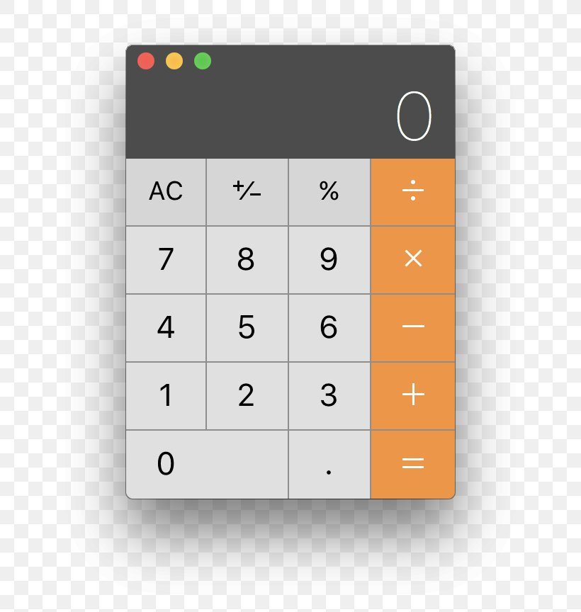
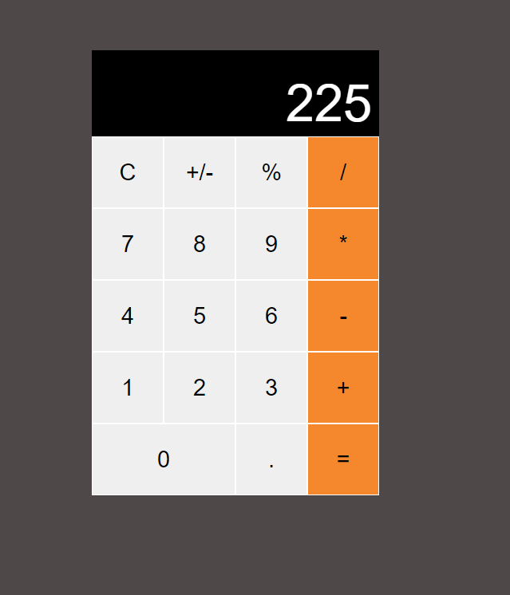

## Apple Calculator Imitation

This is my rendition of Apple's preinstalled calculator on macOS made with HTML, CSS, and JavaScript

## Screenshots

Inspiration            |  Result
:----------------------:|:----------------------:
 |  

I built this project as my first step towards getting to understand Javascript more. I hope to build more complicated apps and websites with javascript and maybe pick up React or Node to make something more interactive.

Thanks for reading!
